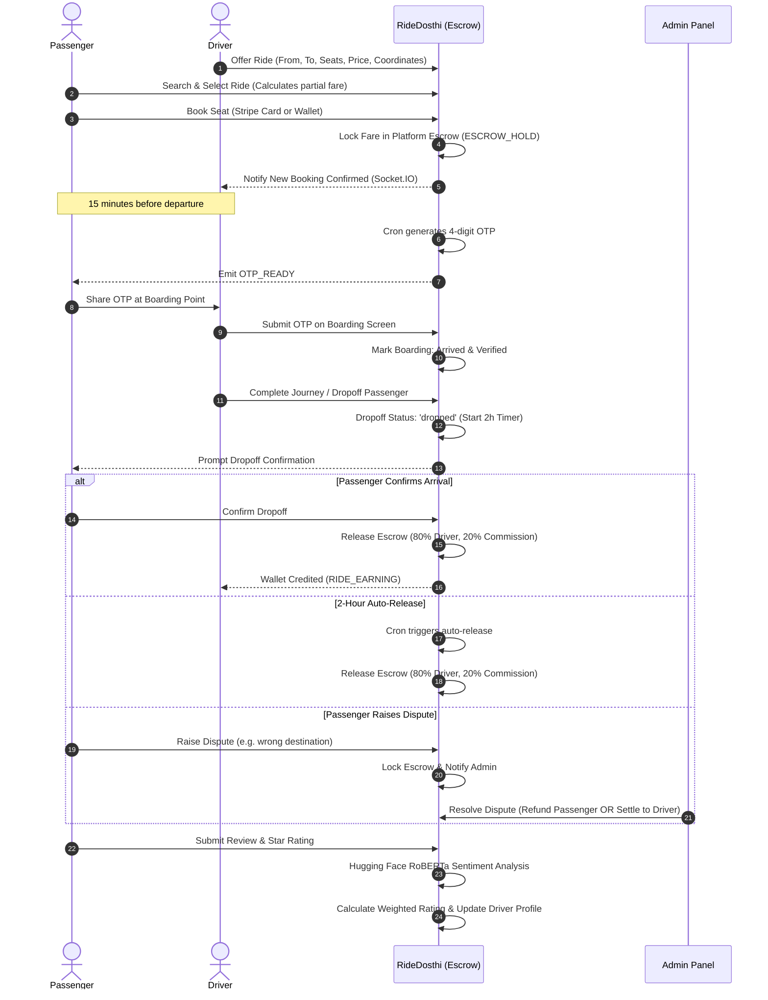

# 🚗 RideDosthi — Next-Gen Safe & Verified Ride-Sharing Platform

[](https://react.dev/)
[](https://vitejs.dev/)
[](https://nodejs.org/)
[](https://expressjs.com/)
[](https://www.mongodb.com/)
[](https://socket.io/)
[](https://stripe.com/)
[](https://js.langchain.com/)
[](https://www.pinecone.io/)
[](https://groq.com/)
[](https://tailwindcss.com/)

---

## 📌 Executive Summary

**RideDosthi** is an intelligent, high-trust inter-city and intra-city ride-sharing platform designed specifically to solve the safety, reliability, and pricing challenges of community carpooling and bike-pooling.

Unlike traditional ride-hailing aggregators, RideDosthi operates on a **peer-to-peer shared-cost model** enhanced by state-of-the-art **Artificial Intelligence, Retrieval-Augmented Generation (RAG), Geospatial Route Intercepts, 4-Digit OTP Boarding Verification, and Dual-Escrow Financial Protection**.

---

## 🌟 Key Highlights & Core Innovations

### 1. 🧭 GPS Route Intercept & Smart Geospatial Matching
* **3-Tier Matching Algorithm**:
  * **Method A (GPS Route Intercept)**: Leverages MongoDB `2dsphere` spatial indexing on OSRM GeoJSON `LineString` route points. Discovers available rides whose travel paths pass within **35 km** of a passenger's pickup location, validating that the pickup point occurs *before* the dropoff point along the driver's trajectory.
  * **Method B (Text & Simplified Location Search)**: Fuzzy text matching for major transit hubs and city names.
  * **Method C (Route Fallback Engine)**: Resilient fallback ensuring zero false-negative ride omissions.
* **Haversine Distance-Based Dynamic Partial Fare Calculation**: Passengers joining midway along a route pay only for the fractional distance traveled (`Haversine distance ratio × full fare`), computed instantly on the server with zero external API fees.
* **Vehicle Diversity**: Supports both **Car** (comfort, AC, luggage) and **Bike** (budget-friendly, agile urban transit).
* **Gender-Preferences**: Drivers and passengers can restrict rides to `female-only`, `male-only`, or `any` for safety and comfort.

### 2. 🤖 AI Dynamic Fare Prediction Engine
* Powered by **Groq LLaMA 3.3 70B** (`llama-3.3-70b-versatile`).
* Computes competitive, fair-market price brackets (min/max in ₹ INR) by evaluating:
  * Exact road distance in kilometers.
  * Fuel efficiency differentials (Car ~15 km/L vs. Bike ~50 km/L).
  * Regional Indian transit economic baselines.

### 3. 🧠 24/7 Autonomous RAG Support Assistant
* **Hosted Pinecone Vector Database** using `llama-text-embed-v2` inference.
* **Groq LLaMA 3.1 8B** (`llama-3.1-8b-instant`) generation via LangChain conversational retrieval chains.
* Ingests platform policy guides and operational documentation:
  * `RD_Doc1_Passenger_Guide.pdf`
  * `RD_Doc2_Rider_Guide.pdf`
  * `RD_Doc3_Payment_Wallet_FAQ.pdf`
  * `RD_Doc4_Safety_Policy.pdf`
  * `RD_Doc5_Troubleshooting.pdf`
  * `RD_Doc6_Terms_Policies.pdf`
* Features conversational memory with `ChatSession` persistence in MongoDB and per-client thread management.

### 4. 💬 NLP Sentiment-Weighted Rating & Review System
* Dual-component rating calculation:
  $$\text{Final Rating} = (\text{Star Rating} \times 0.70) + (\text{NLP Sentiment Score} \times 0.30)$$
* Uses **Hugging Face RoBERTa Transformer** (`cardiffnlp/twitter-xlm-roberta-base-sentiment`) with an offline multi-lingual keyword fallback supporting **English, Hindi, Telugu, Tamil, and Kannada**.
* **Conflict & Toxicity Detection**: Flags contradictions between numerical star ratings and textual comments (e.g., 5 stars with abusive text or 1 star with glowing commendations).

### 5. 🔐 Zero-Trust Boarding: 4-Digit Dynamic OTP Verification
* Automated 4-digit OTP generated **15 minutes before departure** and delivered via WebSockets.
* Driver boarding console with interactive countdown timer corresponding to the ride's waiting window.
* **Anti-Brute Force Protection**: 5-attempt threshold permanently locks the boarding terminal against fraudulent attempts.
* Unverified passengers are automatically handled by expiration crons with escrow adjustments.

### 6. 💰 Dual-Escrow Financial System & Digital Wallet
* **Payment Flexibility**: Pay via **Stripe Card Checkout** or the integrated **RideDosthi In-App Wallet**.
* **Secure Platform Escrow**: Passenger funds are locked in escrow upon booking confirmation and never released prematurely.
* **2-Step Safe Dropoff**:
  1. Driver marks passenger as dropped off.
  2. Passenger confirms safe arrival.
  3. Escrow releases **80% to Driver Wallet** and retains **20% Platform Commission**.
* **2-Hour Auto-Release Safeguard**: If a passenger neither confirms nor disputes within 2 hours of dropoff, funds auto-release to the driver.
* **Dispute Arbitration**: Disputed dropoffs freeze escrow and alert admin with one-click resolution (Refund Passenger or Release to Driver).

### 7. 🛡️ Trust, KYC & Safety Framework
* **Document Masking**: Aadhaar card numbers are securely stored and masked (`XXXX-XXXX-1234`) across all responses. Driving licenses are required for drivers.
* **100-Point Dynamic Trust Score**: Fluctuates based on completed journeys, dispute rates, punctuality, and cancellation histories.
* **Disciplinary System**: Graduated penalties from **Warnings** → **Strikes** → **Temporary/Permanent Account Restrictions**.
* **Cancellation Relief & Priority Badges**: Passengers affected by driver cancellations receive a **Priority Badge** granting:
  * **10% Platform-Funded Subsidy** on subsequent bookings.
  * Priority listing on ride search results.

### 8. ⚡ Real-Time WebSockets & Notifications
* Powered by **Socket.IO** with targeted rooms:
  * `user_<userId>`: Private alerts, booking confirmations, OTP notifications.
  * `ride_<rideId>`: Live journey status, driver arrival, passenger boarding updates.
  * `admin_pool`: Real-time dispute alerts, high-value transaction notifications.

### 9. 🕒 Autonomous Background Hardening Crons
* **OSRM Route Recovery**: Continuously retries fetching route geometries for rides with pending routing status.
* **Pre-departure OTP Generator**: Automatically scans and emits boarding codes 15 minutes prior to departure.
* **Auto-Refund Engine**: Auto-cancels no-show passengers and refunds balances when departure windows lapse without boarding.
* **Escrow Auto-Release**: Disburses earnings for dropped-off journeys after the 2-hour passenger confirmation window.

---

## 🏗️ System Architecture

```mermaid
flowchart TB
    subgraph Client ["Client Layer (React 19 + Vite)"]
        UI["Web App (Tailwind CSS, Framer Motion)"]
        Maps["Leaflet & React-Leaflet Maps"]
        Chat["SupportChat RAG Widget"]
        SocketC["Socket.IO Client"]
    end

    subgraph Server ["Server Layer (Node.js & Express 5)"]
        GW["API Gateway & Middleware (JWT, CORS, Compression)"]
        R_Auth["Auth & KYC Service"]
        R_Rides["Ride & Geolocation Engine"]
        R_Booking["Booking & Fare Service"]
        R_OTP["OTP Boarding Controller"]
        R_Dropoff["Dropoff & Escrow Manager"]
        R_Payment["Payment & Wallet Engine"]
        R_Review["Review & Sentiment Engine"]
        R_RAG["RAG AI Service"]
        R_Admin["Admin Operations Desk"]
        Cron["Background Hardening Crons"]
        SocketS["Socket.IO Server Manager"]
    end

    subgraph External ["External & Cloud Services"]
        Mongo[("MongoDB Atlas\n(2dsphere, Transactions)")]
        Pinecone[("Pinecone Vector DB\n(llama-text-embed-v2)")]
        Groq["Groq Cloud API\n(LLaMA 3.3 70B & 3.1 8B)"]
        HF["Hugging Face API\n(XLM-RoBERTa Sentiment)"]
        Stripe["Stripe Payments\n(Checkout & Webhooks)"]
        OSRM["OSRM Routing API"]
    end

    UI --> GW
    Maps --> OSRM
    SocketC <--> SocketS
    Chat --> R_RAG

    GW --> R_Auth
    GW --> R_Rides
    GW --> R_Booking
    GW --> R_OTP
    GW --> R_Dropoff
    GW --> R_Payment
    GW --> R_Review
    GW --> R_RAG
    GW --> R_Admin

    Cron --> Mongo
    R_Auth & R_Rides & R_Booking & R_OTP & R_Dropoff & R_Payment & R_Review --> Mongo
    R_Payment --> Stripe
    R_Rides --> OSRM
    R_Rides --> Groq
    R_Review --> HF
    R_RAG --> Pinecone
    R_RAG --> Groq
    R_OTP & R_Dropoff & R_Booking --> SocketS
```



---

## 🔄 Journey & Financial Lifecycle



---

## 💻 Technology Stack

| Category | Technology | Purpose |
| :--- | :--- | :--- |
| **Frontend Framework** | React 19, Vite 6 | High-performance Single Page Application |
| **Styling & Animation** | Tailwind CSS 3.4, Framer Motion | Modern responsive UI, glassmorphism, transitions |
| **Mapping & GIS** | Leaflet 1.9, React-Leaflet 5, OSRM | Interactive maps, route polylines, GPS markers |
| **Icons & Alerts** | Lucide React, React Icons, React Toastify | Visual feedback and iconography |
| **Backend Framework** | Node.js 20+, Express 5 | RESTful API gateway, MVC architecture |
| **Primary Database** | MongoDB Atlas, Mongoose 9 | Document storage, `2dsphere` geospatial indexing |
| **Real-Time Layer** | Socket.IO 4.8 | Low-latency bi-directional event notifications |
| **Vector Database** | Pinecone (`llama-text-embed-v2`) | Embeddings storage for RAG support knowledge |
| **AI LLMs** | Groq (`llama-3.3-70b`, `llama-3.1-8b`) | Dynamic price prediction & conversational RAG |
| **NLP Sentiment** | Hugging Face XLM-RoBERTa Transformer | Multilingual emotion and review scoring |
| **Payments** | Stripe API & Stripe React JS | Credit/Debit Card payments, webhooks, payouts |
| **Security** | JWT, bcryptjs, Cookie-Parser | Stateless authentication, masked credentials |

---

## 📁 Repository Structure

```text
MINI-PROJECT/
├── RD_Doc1_Passenger_Guide.pdf       # Knowledge base: Passenger policies & safety
├── RD_Doc2_Rider_Guide.pdf           # Knowledge base: Driver instructions & guidelines
├── RD_Doc3_Payment_Wallet_FAQ.pdf    # Knowledge base: Escrow, wallet, and refund rules
├── RD_Doc4_Safety_Policy.pdf         # Knowledge base: Zero-tolerance & trust standards
├── RD_Doc5_Troubleshooting.pdf       # Knowledge base: Common issues & resolutions
├── RD_Doc6_Terms_Policies.pdf        # Knowledge base: Platform terms & legal framework
├── README.md                         # Project documentation
│
├── client/                           # Frontend React 19 Application
│   ├── index.html                    # Root HTML file (Google Fonts: Outfit, Leaflet CSS)
│   ├── package.json                  # Frontend dependencies & scripts
│   ├── vite.config.js                # Vite configuration with `/api` proxying
│   ├── tailwind.config.js            # Tailwind CSS configuration
│   └── src/
│       ├── api/
│       │   └── axios.js              # Axios instance with Bearer token interceptor
│       ├── components/
│       │   ├── AddMoneyModal.jsx     # Wallet top-up modal with Stripe Card Element
│       │   ├── BookingModal.jsx      # Ride booking modal with partial fare breakdown
│       │   ├── CancellationModal.jsx # Ride cancellation with trust impact warning
│       │   ├── LocationSelector.jsx  # Interactive map point selector
│       │   ├── MarkArrivedButton.jsx # Driver arrival notification trigger
│       │   ├── Navbar.jsx            # Dynamic navigation bar with wallet balance & badge
│       │   ├── OTPDisplay.jsx        # Passenger OTP viewer modal
│       │   ├── PassengerList.jsx     # Driver view of confirmed passengers
│       │   ├── ProtectedRoute.jsx    # Authentication-guarded route wrapper
│       │   ├── ReviewModal.jsx       # Star & feedback submission with sentiment feedback
│       │   ├── StripePaymentForm.jsx # Stripe Elements wrapper
│       │   ├── SupportChat.jsx       # Floating RAG AI support chatbot widget
│       │   └── WithdrawMoneyModal.jsx# Driver payout request interface
│       ├── context/
│       │   ├── AuthContext.jsx       # Authentication state & login/register handlers
│       │   ├── NotificationContext.jsx# In-app push notification state
│       │   └── SocketContext.jsx     # Socket.io connection provider
│       └── pages/
│           ├── AdminDashboard.jsx    # Financial statistics, disputes, and audit logs
│           ├── BoardingScreen.jsx    # Driver OTP validation terminal with countdown
│           ├── Dashboard.jsx         # User central hub (stats, upcoming rides)
│           ├── FindRides.jsx         # Geospatial search interface with filters
│           ├── Home.jsx              # High-converting landing page
│           ├── Login.jsx             # User authentication
│           ├── MyBookings.jsx        # Passenger bookings, OTPs, and dropoff tracking
│           ├── MyRides.jsx           # Driver ride management & passenger manifests
│           ├── OfferRide.jsx         # Ride publishing with AI Price estimation
│           ├── PriorityBenefits.jsx  # Priority badge information & subsidy perks
│           ├── Profile.jsx           # User profile, KYC status, and trust score
│           ├── Register.jsx          # User registration with Aadhaar & DL input
│           ├── RidePassengers.jsx    # Live passenger management per ride
│           ├── RideResults.jsx       # Filtered search results with map routes
│           ├── TransactionHistory.jsx# Detailed wallet ledger (credits/debits/escrows)
│           └── UserManagement.jsx    # Admin user directory & disciplinary actions
│
└── server/                           # Backend Node.js / Express 5 Application
    ├── index.js                      # Express HTTP & Socket.IO server initialization
    ├── package.json                  # Backend dependencies & scripts
    ├── config/
    │   ├── db.js                     # MongoDB connection handler
    │   └── stripe.js                 # Stripe client initialization
    ├── controllers/
    │   ├── adminController.js        # Platform analytics, disputes, user bans
    │   ├── authController.js         # User registration, login, KYC, profile
    │   ├── bookingController.js      # Booking lifecycle, Stripe intents, partial fares
    │   ├── dropoffController.js      # Safe dropoff, escrow releases, disputes
    │   ├── notificationController.js # Push notifications handling
    │   ├── otpController.js          # Boarding verification, OTP validation, lockouts
    │   ├── paymentController.js      # Wallet top-up, withdrawals, Stripe webhooks
    │   ├── ragController.js          # RAG chat handler & session memory
    │   ├── reviewController.js       # Reviews submission & sentiment calculation
    │   └── rideController.js         # Ride publishing, search radar, crons, cancel
    ├── middleware/
    │   ├── authMiddleware.js         # JWT token verification & role authorization
    │   └── socketMiddleware.js       # Socket.IO connection authentication
    ├── models/
    │   ├── ChatSession.js            # RAG conversation history model
    │   ├── Notification.js           # User notification records
    │   ├── Payout.js                 # Driver bank withdrawal requests
    │   ├── Review.js                 # Reviews with RoBERTa sentiment scores
    │   ├── Ride.js                   # Rides, geospatial route points, and bookings
    │   ├── Transaction.js            # Wallet & Escrow transaction audit trail
    │   └── User.js                   # User schema (KYC, Trust Score, Wallet, Strikes)
    ├── routes/
    │   ├── adminRoutes.js            # `/api/admin/*`
    │   ├── auth.js                   # `/api/auth/*`
    │   ├── bookings.js               # `/api/bookings/*`
    │   ├── dropoff.js                # `/api/dropoff/*`
    │   ├── notificationRoutes.js     # `/api/notifications/*`
    │   ├── otp.js                    # `/api/otp/*`
    │   ├── payments.js               # `/api/payments/*`
    │   ├── ragRoutes.js              # `/api/rag/*`
    │   ├── reviewRoutes.js           # `/api/reviews/*`
    │   └── rideRoutes.js             # `/api/rides/*`
    └── utils/
        ├── aiPricing.js              # Groq LLaMA 3.3 dynamic pricing engine
        ├── fareHelper.js             # Haversine distance & partial fare math
        ├── ingestDocs.js             # Pinecone document ingestion script
        ├── otpHelper.js              # Cryptographic 4-digit OTP generator
        ├── ragService.js             # LangChain RAG pipeline & vector search
        ├── sentimentAnalyzer.js      # Hugging Face & multi-lingual keyword NLP
        └── socketManager.js          # Socket.io room broadcaster
```

---

## 🗄️ Database Schemas & Models

### `User`
* **Credentials & Identity**: `name`, `email`, `phone`, `password` (bcrypt-hashed), `gender`, `role` (`user` | `admin`).
* **KYC Details**: `aadhaarNumber` (automatically masked to `XXXX-XXXX-1234`), `licenseNumber`, `isVerified`.
* **Trust & Discipline**: `trustScore` (default 100), `warnings`, `strikes`, `restrictedUntil`, `restrictionReason`.
* **Wallet**: `walletBalance` (in ₹), `walletTransactions` sub-document ledger.
* **Reputation & Badges**: `averageRating`, `starOnlyRating`, `totalRatings`, `priorityBadgeExpires`.

### `Ride`
* **Route & Geometry**:
  * `from` & `to` location strings.
  * `fromCoordinates` & `toCoordinates` (GeoJSON `Point` [lng, lat]).
  * `routePoints` (GeoJSON `LineString` array of coordinates for spatial search).
  * `routePointsStatus` (`pending` | `saved` | `failed`).
* **Ride Attributes**: `date`, `time`, `seatsAvailable`, `vehicleType` (`Car` | `Bike`), `carModel`, `carNumber`, `price`, `genderPreference` (`any` | `male-only` | `female-only`).
* **Status**: `available` | `full` | `ongoing` | `completed` | `cancelled`.
* **Embedded Bookings**:
  * `passenger`, `fareCharged`, `systemSubsidy`, `totalDriverEarnings` (80%), `paymentMethod` (`cash` | `online` | `wallet`).
  * `otp`, `otpVerified`, `otpAttempts`, `otpLocked`, `boardingStatus` (`pending` | `arrived` | `not_arrived`).
  * `dropoffStatus` (`pending` | `dropped` | `confirmed` | `disputed` | `auto_released` | `refunded`).
  * `autoReleaseAt`, `fareReleased`, `disputeRaised`.

### `Review`
* `reviewer`, `subject` (User references), `rideId`.
* `rating` (Raw 1–5 stars).
* `comment` (Up to 500 characters).
* `sentimentScore` (-1.00 to +1.00), `sentimentLabel` (`POSITIVE` | `NEGATIVE` | `NEUTRAL`).
* `intensityLevel` (`LOW` | `MEDIUM` | `HIGH`).
* `conflictDetected` (Boolean indicating contradiction between text sentiment and numerical rating).
* `finalRating` (Computed composite score).

### `Transaction`
* Tracks all monetary actions: `COMMISSION`, `SUBSIDY`, `TRANSFER`, `TOPUP`, `RIDE_PAYMENT`, `RIDE_EARNING`, `REFUND`, `WITHDRAWAL`, `ESCROW_HOLD`, `ESCROW_RELEASE`.
* Stores financial metadata: `originalFare`, `commissionAmount`, `subsidyAmount`, `passengerPays`, `driverEarns`.

---

## 📡 API Reference Catalog

### Authentication (`/api/auth`)
| Method | Endpoint | Access | Description |
| :--- | :--- | :--- | :--- |
| `POST` | `/api/auth/register` | Public | Register new user with Aadhaar and driving license |
| `POST` | `/api/auth/login` | Public | Authenticate user and receive JWT token |
| `POST` | `/api/auth/logout` | Private | Clear session cookies and invalidate token |
| `GET` | `/api/auth/me` | Private | Retrieve authenticated user profile with masked KYC |
| `PUT` | `/api/auth/profile` | Private | Update user profile and notification preferences |

### Rides & Geospatial Radar (`/api/rides`)
| Method | Endpoint | Access | Description |
| :--- | :--- | :--- | :--- |
| `POST` | `/api/rides/offer` | Private | Publish a new ride with OSRM route calculation |
| `POST` | `/api/rides/predict-price`| Private | Get AI-predicted fair market pricing from Groq |
| `GET` | `/api/rides` | Private | Smart search rides (GPS intercept, text, or date) |
| `GET` | `/api/rides/my-offers` | Private | List rides published by the authenticated driver |
| `GET` | `/api/rides/driver-stats`| Private | Driver performance metrics (earnings, rides, rating) |
| `PATCH`| `/api/rides/:id/cancel`| Private | Driver cancels ride (triggers priority badges/subsidies) |
| `PATCH`| `/api/rides/:id/complete`| Private| Mark journey as completed |

### Bookings & Fares (`/api/bookings`)
| Method | Endpoint | Access | Description |
| :--- | :--- | :--- | :--- |
| `POST` | `/api/bookings/checkout`| Private | Generate Stripe PaymentIntent for seat booking |
| `POST` | `/api/bookings` | Private | Confirm booking (Stripe, wallet, or cash) and hold escrow |
| `GET` | `/api/bookings/my` | Private | List user's active and upcoming bookings |
| `DELETE`| `/api/bookings/:rideId` | Private | Passenger cancels booking before departure |
| `GET` | `/api/bookings/ride/:rideId`| Private (Driver)| Retrieve passenger manifest for a ride |

### OTP & Boarding (`/api/otp`)
| Method | Endpoint | Access | Description |
| :--- | :--- | :--- | :--- |
| `GET` | `/api/otp/boarding/:rideId` | Private (Driver)| Retrieve live boarding manifest and remaining window |
| `POST` | `/api/otp/verify` | Private (Driver)| Verify passenger 4-digit OTP (locks on 5 failures) |
| `POST` | `/api/otp/mark-arrived/:rideId`| Private (Driver)| Mark driver presence at pickup point |

### Dropoff & Escrow Settlement (`/api/dropoff`)
| Method | Endpoint | Access | Description |
| :--- | :--- | :--- | :--- |
| `POST` | `/api/dropoff/driver/:rideId/:passengerId` | Private (Driver)| Driver marks passenger as dropped off |
| `POST` | `/api/dropoff/passenger/confirm/:rideId` | Private (Passenger)| Passenger confirms dropoff; releases 80/20 escrow |
| `GET` | `/api/dropoff/status/:rideId` | Private | Check real-time dropoff and escrow status |

### Payments & Wallet (`/api/payments`)
| Method | Endpoint | Access | Description |
| :--- | :--- | :--- | :--- |
| `GET` | `/api/payments/wallet` | Private | Retrieve current wallet balance |
| `POST` | `/api/payments/topup/intent` | Private | Create Stripe PaymentIntent for wallet top-up |
| `POST` | `/api/payments/topup/confirm`| Private | Credit wallet upon Stripe confirmation |
| `GET` | `/api/payments/wallet/statement` | Private | Retrieve full ledger transactions history |
| `POST` | `/api/payments/withdraw` | Private | Driver requests withdrawal to bank account |
| `POST` | `/api/payments/webhook` | Public | Stripe raw webhook receiver |

### Reviews & Sentiment (`/api/reviews`)
| Method | Endpoint | Access | Description |
| :--- | :--- | :--- | :--- |
| `POST` | `/api/reviews/:rideId/:userId`| Private | Submit rating & review; triggers RoBERTa analysis |
| `GET` | `/api/reviews/:userId` | Public | Retrieve verified reviews and composite score |

### AI Support Assistant (`/api/rag`)
| Method | Endpoint | Access | Description |
| :--- | :--- | :--- | :--- |
| `POST` | `/api/rag/chat` | Public | Query RAG assistant with conversational thread tracking |
| `POST` | `/api/rag/clear-history` | Public | Reset conversational memory for active thread |

### Admin Control (`/api/admin`)
| Method | Endpoint | Access | Description |
| :--- | :--- | :--- | :--- |
| `GET` | `/api/admin/dashboard` | Admin Only | Platform statistics (Commissions, Subsidies, Escrow) |
| `GET` | `/api/admin/users` | Admin Only | User directory, trust scores, KYC verification |
| `POST` | `/api/admin/settle-dispute/:rideId/:passengerId` | Admin Only | Settle dispute in driver's favor |
| `POST` | `/api/admin/refund-dispute/:rideId/:passengerId` | Admin Only | Settle dispute in passenger's favor with full refund |

---

## 🔌 Socket.IO Real-Time Events

| Event Name | Direction | Payload | Description |
| :--- | :--- | :--- | :--- |
| `join_ride_room` | Client → Server | `rideId` | Join live updates for a specific ride |
| `leave_ride_room` | Client → Server | `rideId` | Leave a ride's event room |
| `otp_ready` | Server → Client | `{ rideId, otp, message }` | Emitted to passenger when boarding OTP is generated |
| `passenger_verified`| Server → Client | `{ rideId, passengerId }` | Emitted to ride room when OTP verification succeeds |
| `driver_arrived` | Server → Client | `{ rideId, message }` | Emitted when driver marks arrival at pickup |
| `dropoff_marked` | Server → Client | `{ rideId, passengerId }` | Emitted when driver marks passenger dropped |
| `escrow_released`| Server → Client | `{ rideId, amount }` | Emitted when escrow is credited to driver wallet |
| `dispute_alert` | Server → Client | `{ rideId, passengerId }` | Emitted to `admin_pool` when passenger disputes dropoff |

---

## ⚙️ Environment Variables

### Server Configuration (`server/.env`)

```env
# Application
PORT=5000
NODE_ENV=development
CLIENT_URL=http://localhost:5173

# Database
MONGO_URI=mongodb+srv://<username>:<password>@<cluster>.mongodb.net/ride-dosthi?retryWrites=true&w=majority

# Authentication
JWT_SECRET=your_super_secret_jwt_key_at_least_32_characters_long
JWT_EXPIRES_IN=7d

# Stripe Payments
STRIPE_PUBLISHABLE_KEY=pk_test_...
STRIPE_SECRET_KEY=sk_test_...
STRIPE_WEBHOOK_SECRET=whsec_...

# AI & LLMs (Groq Cloud)
GROQ_API_KEY=gsk_...

# Vector Database (Pinecone)
PINECONE_API_KEY=pcsk_...
PINECONE_INDEX_NAME=ride-dosthi-knowledge

# Hugging Face (NLP Sentiment Analysis)
HUGGING_FACE_API_KEY=hf_...
HUGGING_FACE_MODEL=cardiffnlp/twitter-xlm-roberta-base-sentiment
SENTIMENT_FALLBACK=keyword
```

### Client Configuration (`client/.env`)

```env
# Stripe Publishable Key
VITE_STRIPE_PUBLISHABLE_KEY=pk_test_...

# Optional: Set custom API base URL if not running on default Vite proxy
# VITE_API_URL=http://localhost:5000/api
```

---

## 🚀 Quickstart & Installation Guide

### Prerequisites
* **Node.js**: v18.0.0 or higher
* **npm**: v9.0.0 or higher
* **MongoDB**: A running local instance or MongoDB Atlas connection URI
* **Stripe Account**: Test API keys
* **Groq API Key**: Free tier available at [groq.com](https://groq.com)
* **Pinecone Account**: Vector index configured with `1024` or model dimension for `llama-text-embed-v2`

---

### Step 1: Clone the Repository
```bash
git clone https://github.com/your-username/ride-dosthi.git
cd MINI-PROJECT
```

---

### Step 2: Backend Setup
```bash
# Navigate to the server directory
cd server

# Install dependencies
npm install

# Create and configure .env file
cp .env.example .env   # Or create server/.env and fill in required keys

# Ingest Knowledge Base PDFs into Pinecone (Run once or whenever PDFs are updated)
node utils/ingestDocs.js

# Start backend server in development mode
npm run dev
```
> The server will start on `http://localhost:5000` and establish database connections, initialize Socket.IO, and trigger background hardening crons.

---

### Step 3: Frontend Setup
```bash
# Open a new terminal and navigate to the client directory
cd ../client

# Install dependencies
npm install

# Start Vite development server
npm run dev
```
> The client will be live at `http://localhost:5173`.

---

## 🧪 Testing & Verification Workflows

### 1. Test AI Dynamic Pricing
* Navigate to **Offer Ride** (`/offer-ride`).
* Input Pickup: `Bangalore`, Destination: `Mysore`.
* Click **Calculate AI Fair Price**: Groq LLaMA 3.3 will calculate real-time distance and recommend a competitive INR price bracket.

### 2. Test OTP Boarding Flow
* Log in as User A and publish a ride departing within the next 15 minutes.
* Log in as User B (incognito or second browser) and book a seat using Test Wallet or Card.
* The backend cron generates an OTP and emits `otp_ready` to User B.
* User B opens **My Bookings** and views the 4-digit OTP.
* User A navigates to **Boarding Screen** (`/my-rides/:id/boarding`), inputs the OTP, and verifies the passenger.

### 3. Test Safe Dropoff & Escrow
* On the Boarding/Passenger Screen, the driver clicks **Mark as Dropped Off**.
* Passenger receives a prompt to confirm safe arrival on **My Bookings**.
* Upon confirmation, platform escrow distributes **80% to the driver's wallet** and recognizes **20% platform commission**.

### 4. Test RAG Support Chatbot
* Click the floating chat bubble on the bottom-right of any page.
* Ask: *"What happens if my driver cancels the ride?"*
* The assistant retrieves exact policy rules from `RD_Doc1_Passenger_Guide.pdf` and provides information about the **Priority Badge** and **10% fee subsidy**.

### 5. Test Review & Sentiment Analyzer
* Complete a journey and submit a review.
* Example text: *"Driver was extremely polite, safe driving, highly recommended!"*
* Check the profile: RoBERTa marks the sentiment as `POSITIVE` (+0.80 score) and raises the driver's composite rating higher than the raw star score.

---

## 🛡️ Disciplinary Matrix & Trust Policies

| Infraction | Penalty | Action Taken |
| :--- | :--- | :--- |
| First-time cancellation without notice | Warning | Trust score drops by 5 points |
| Second cancellation within 30 days | Strike 1 | Trust score drops by 10 points |
| Unjustified passenger no-show | Strike 2 | 48-hour temporary booking lock |
| 3 Strikes Accumulated | Account Restriction | 14-day platform suspension |
| Driver cancellation < 2 hours before trip | Automatic Subsidy | Driver penalized; passenger receives Priority Badge + 10% subsidy |
| 5 Failed OTP Boarding Attempts | Terminal Lock | Identity terminal locked; requires admin verification |

---

## 📄 License & Contributing

Distributed under the **ISC License**.

Contributions, feature suggestions, and pull requests are welcome. For major architectural changes, please open an issue first to discuss your proposed updates.
